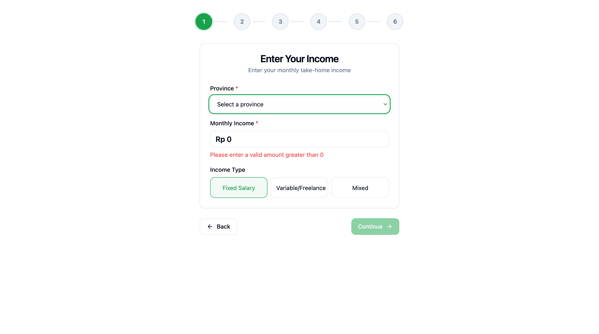
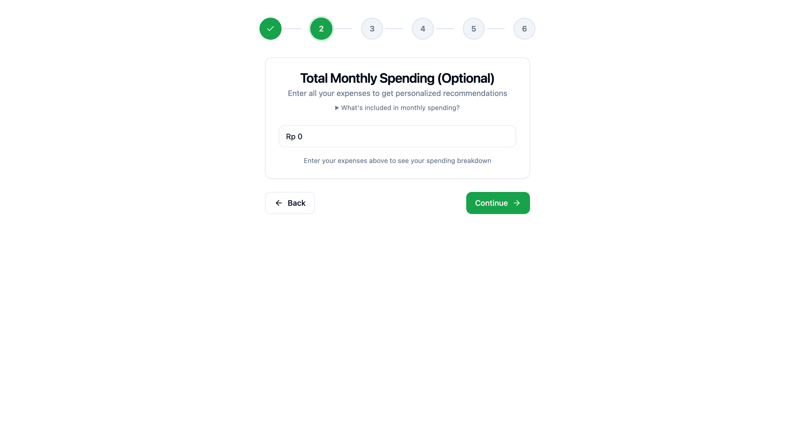
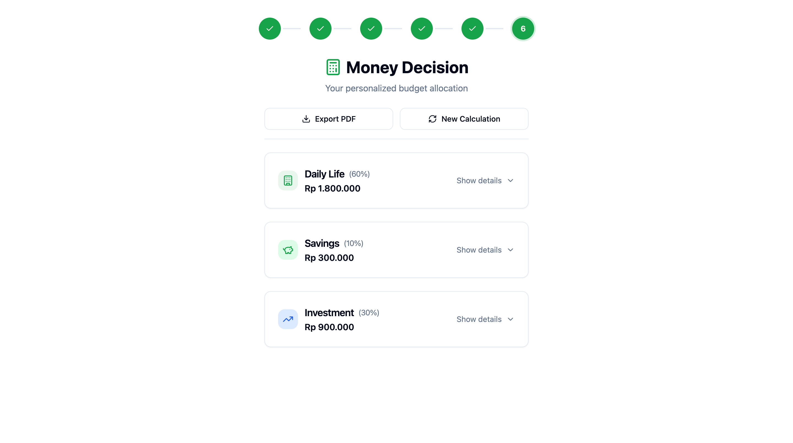

# 💰 Money Decision - Financial Planning Wizard

> A comprehensive web-based financial planning tool helping Indonesians make informed decisions about money allocation across daily expenses, savings, and investments.

[](https://reactjs.org/)
[](https://www.typescriptlang.org/)
[](https://vitejs.dev/)
[](https://tailwindcss.com/)
[](https://vitest.dev/)

[Live Demo](#) • [Documentation](docs/prd-money-decision.md) • [Report Bug](issues) • [Request Feature](issues)

## Table of Contents

- [About](#about)
- [Features](#features)
- [Demo](#demo)
- [Tech Stack](#tech-stack)
- [Getting Started](#getting-started)
- [Usage](#usage)
- [Project Structure](#project-structure)
- [Development](#development)
- [Testing](#testing)
- [Contributing](#contributing)
- [License](#license)
- [Acknowledgments](#acknowledgments)

## About

Money Decision is a financial planning wizard designed specifically for the Indonesian market. With over **71 million Indonesians** in the "sandwich generation" supporting both parents and children, and **9.18 million pinjol accounts** among young adults, there's a critical need for accessible financial guidance.

### The Problem

- Many makers and freelancers don't know how much to spend vs. save vs. invest
- Unclear emergency fund targets
- High-interest debt (pinjol) trapping users in debt spirals
- No structured approach to personal finance management

### The Solution

A guided 6-step wizard that:

- Calculates optimal money allocation based on income and family obligations
- Provides salary position insights using real BPS (Statistics Indonesia) data
- Forecasts debt payoff timelines for pinjol debt
- Offers interactive investment education with calculators
- Delivers personalized recommendations based on provincial cost of living

## Features

### 🎯 6-Step Financial Planning Wizard

| Step | Feature                    | Description                                                  |
| ---- | -------------------------- | ------------------------------------------------------------ |
| 1️⃣   | **Income & Location**      | Enter monthly income and select from 38 Indonesian provinces |
| 2️⃣   | **Monthly Expenses**       | Optional expense tracking with budget comparison             |
| 3️⃣   | **Pinjol Debt Assessment** | Online loan debt tracking with payoff forecasting            |
| 4️⃣   | **Sandwich Generation**    | Family support obligation adjustment                         |
| 5️⃣   | **Budget Rule Selection**  | Choose from 60/30/10, 50/30/20, or custom allocation         |
| 6️⃣   | **Results & Guidance**     | Comprehensive financial breakdown with actionable insights   |

### ✨ Key Capabilities

- **📊 Salary Position Insights** - Compare your income to provincial and national averages using BPS wage data
- **💸 Pinjol Debt Payoff Forecasting** - Calculate exact debt-free timeline with interest/principal breakdown
- **🎓 Investment Education Modal** - Interactive learning with compound interest calculators and product comparisons
- **👨‍👩‍👧 Sandwich Generation Support** - Adjusted budget recommendations for family support obligations
- **📱 Responsive Design** - Mobile-first with WCAG 2.1 AA accessibility compliance
- **💾 State Persistence** - LocalStorage-based wizard progress saving (survives page refresh)
- **🌏 Indonesian Context** - Reksadana, SBN Ritel, and local investment products

## Demo

### Live Application

[Visit Money Decision Wizard](#) _(Add deployment URL)_

### Screenshots

#### Step 1: Income & Province Selection


_Select your province and enter monthly income to receive personalized salary insights_

#### Salary Position Insights


_See how your income compares to provincial and national averages (BPS data)_

#### Step 3: Pinjol Debt Payoff Forecast


_Calculate debt-free timeline with exact date and total interest_

#### Investment Education Modal


_Learn about Indonesian investment products with interactive calculators_

#### Final Results


_Comprehensive financial breakdown with savings, investment, and daily life allocations_

## Tech Stack

### Frontend

- **Framework**: React 18.2 with TypeScript 5.3
- **Build Tool**: Vite 5.0 (fast HMR, optimized builds)
- **Styling**: Tailwind CSS 3.4 + shadcn/ui components
- **Routing**: React Router 7 (route-based wizard flow)
- **State Management**: Custom hooks + localStorage persistence

### Testing & Quality

- **Testing**: Vitest 4.0 + React Testing Library + happy-dom/jsdom
- **Linting**: ESLint 9 with TypeScript and React plugins
- **Formatting**: Prettier 3.8
- **Accessibility**: WCAG 2.1 AA compliant

### Data Sources

- **BPS (Badan Pusat Statistik)**: Average wages by province (August 2025)
- **Gini Coefficient**: Income inequality data (September 2024)
- **Financial Guidelines**: NerdWallet, WalletHub, TIME, Ramit Sethi's CSP

## Getting Started

### Prerequisites

- Node.js 18+ and npm
- Modern browser (Chrome, Firefox, Safari, Edge - last 2 versions)

### Installation

1. **Clone the repository**

   ```bash
   git clone https://github.com/naufaldi/money-decision.git
   cd money-decision
   ```

2. **Install dependencies**

   ```bash
   npm install
   ```

3. **Start development server**

   ```bash
   npm run dev
   ```

4. **Open your browser**
   ```
   http://localhost:5173
   ```

### Available Scripts

| Command                | Description                               |
| ---------------------- | ----------------------------------------- |
| `npm run dev`          | Start Vite dev server with HMR            |
| `npm run build`        | Build for production (outputs to `dist/`) |
| `npm run preview`      | Preview production build locally          |
| `npm run test`         | Run Vitest tests                          |
| `npm run test:ui`      | Run tests with Vitest UI                  |
| `npm run lint`         | Lint code with ESLint                     |
| `npm run lint:fix`     | Auto-fix linting issues                   |
| `npm run format`       | Format code with Prettier                 |
| `npm run format:check` | Check code formatting                     |

## Usage

### Basic Workflow

1. **Enter Income & Province** - Start by providing your monthly income and selecting your province from 38 Indonesian provinces
2. **View Salary Insights** - Automatically see how your income compares to provincial and national averages
3. **Add Expenses (Optional)** - Track your monthly spending to see budget recommendations
4. **Assess Pinjol Debt** - If you have online loan debt, enter amount, interest rate, and monthly payment to forecast payoff
5. **Indicate Family Support** - Select if you support elderly parents or younger siblings (sandwich generation)
6. **Choose Budget Rule** - Select a budget allocation rule or create custom percentages
7. **Review Results** - Get comprehensive financial breakdown with actionable guidance

### Example Scenario

**User Profile**: Freelance developer in Jakarta, Rp 8,000,000/month income, supporting parents

**Wizard Output**:

- Salary Position: Top 15% in Jakarta, Top 10% nationally
- Recommended Rule: 60/30/10 adjusted for family support
- Daily Life: Rp 5,200,000 (65% - higher due to family support)
- Savings: Rp 2,000,000 (25%)
- Investment: Rp 800,000 (10%)
- Guidance: Build 6-month emergency fund (Rp 31.2M) before aggressive investing

## Project Structure

```
money-decision/
├── src/
│   ├── components/
│   │   ├── wizard/              # 6-step wizard components
│   │   │   ├── pages/           # Route-based wizard pages
│   │   │   │   ├── IncomePage.tsx
│   │   │   │   ├── ExpensesPage.tsx
│   │   │   │   ├── PinjolPage.tsx
│   │   │   │   ├── SandwichPage.tsx
│   │   │   │   ├── RulePage.tsx
│   │   │   │   └── ResultsPage.tsx
│   │   │   ├── Wizard.tsx       # Main wizard container
│   │   │   ├── StepIndicators.tsx
│   │   │   └── WizardRouteGuard.tsx
│   │   ├── investment-education/  # Investment modal & calculators
│   │   │   ├── InvestmentEducationModal.tsx
│   │   │   ├── CompoundInterestCalculator.tsx
│   │   │   └── RiskProfileMiniQuiz.tsx
│   │   ├── guidance/            # Context-aware guidance system
│   │   └── ui/                  # shadcn/ui base components
│   ├── hooks/
│   │   └── useWizardState.ts    # Wizard state + localStorage
│   ├── utils/
│   │   ├── calculators.ts       # Financial calculations
│   │   ├── pinjolCalculator.ts  # Debt payoff forecasting
│   │   ├── salaryPercentile.ts  # BPS percentile calculations
│   │   └── pdfExport.ts         # Export financial plan
│   ├── data/
│   │   ├── guidance/            # Context-aware guidance content
│   │   ├── salary/              # BPS wage data (JSON)
│   │   └── investmentProducts.ts
│   ├── constants/               # Budget rules, savings targets
│   ├── types/                   # TypeScript interfaces
│   └── App.tsx                  # Root component with routing
├── docs/
│   ├── prd-money-decision.md    # Product Requirements Document
│   ├── plans/                   # Implementation plans
│   └── [feature].md             # Feature-specific documentation
├── dist/                        # Production build output
├── .beads/                      # Issue tracking (Beads)
└── package.json
```

## Development

### Architecture Patterns

#### 1. Route-Based Wizard

Each wizard step is a separate route with route guards preventing step skipping:

```typescript
/wizard/income → /wizard/expenses → /wizard/pinjol →
/wizard/sandwich → /wizard/rule → /wizard/results
```

#### 2. LocalStorage State Persistence

```typescript
// State automatically persists across page refreshes
const { state, updateState } = useWizardState();
// STORAGE_KEY: 'money-decision-wizard-state'
```

#### 3. CustomEvent-Based Modal Triggers

```typescript
// Loose coupling between components
window.dispatchEvent(new CustomEvent('showInvestmentEducation'));
```

#### 4. Context-Aware Guidance

Dynamic guidance based on:

- Income level (entry: Rp 2-5M, mid: Rp 5-10M, high: >Rp 10M)
- Province (cost of living adjustments)
- Debt status (pinjol debt warnings)
- Family obligations (sandwich generation)

### Adding New Features

1. **New Wizard Step**
   - Create page component in `src/components/wizard/pages/`
   - Add route in `src/App.tsx`
   - Update `useWizardState` interface
   - Add route guard validation

2. **New Calculator**
   - Add function to `src/utils/calculators.ts`
   - Write unit tests (`*.test.ts`)
   - Export via barrel file

3. **New Guidance Content**
   - Add content to `src/data/guidance/`
   - Follow `GuidanceSection` interface
   - Include citations and sources

## Testing

### Running Tests

```bash
# Run all tests
npm run test

# Run tests with UI
npm run test:ui

# Run tests in watch mode
npm run test -- --watch

# Run tests with coverage
npm run test -- --coverage
```

### Test Coverage

- **Unit Tests**: Financial calculations, percentile calculations, pinjol forecasting
- **Component Tests**: Wizard steps, modals, guidance components
- **Integration Tests**: Wizard flow, state persistence

### Writing Tests

```typescript
// Example: Testing pinjol calculator
import { calculatePinjolPayoff } from '@/utils/pinjolCalculator';

describe('calculatePinjolPayoff', () => {
  it('calculates correct payoff timeline', () => {
    const result = calculatePinjolPayoff({
      principal: 10_000_000,
      monthlyRate: 0.05,
      monthlyPayment: 500_000,
    });
    expect(result.months).toBe(24);
    expect(result.totalInterest).toBeCloseTo(1_847_000, -3);
  });
});
```

### Code Quality Gates

Before committing:

```bash
npm run lint && npm run test && npm run format:check
```

## Contributing

We welcome contributions! Please follow these steps:

### 1. Find or Create an Issue

```bash
# Using Beads issue tracker
bd ready                    # Find available work
bd create "Feature: Add tax calculator"  # Create new issue
```

### 2. Development Workflow

1. Fork the repository
2. Create feature branch: `git checkout -b feature/tax-calculator`
3. Make changes and write tests
4. Run quality gates: `npm run lint && npm run test`
5. Commit: `git commit -m "Add tax calculator for freelancers"`
6. Push: `git push origin feature/tax-calculator`
7. Open Pull Request

### 3. Code Standards

- **TypeScript**: Strict mode, no `any` types
- **Components**: Functional components with hooks
- **Styling**: Tailwind CSS utility classes
- **Testing**: Unit tests for utils, component tests for UI
- **Accessibility**: WCAG 2.1 AA compliance required
- **Documentation**: JSDoc comments for functions

### 4. Commit Convention

```
feat: Add pinjol debt payoff forecasting
fix: Correct salary percentile calculation for Jakarta
docs: Update README with deployment instructions
test: Add tests for compound interest calculator
refactor: Extract wizard routing logic
```

### 5. Pull Request Guidelines

- Clear description of changes
- Link to related issue
- Screenshots for UI changes
- All tests passing
- No linting errors

## License

This project is licensed under the MIT License - see the [LICENSE](LICENSE) file for details.

## Acknowledgments

### Data Sources

- **BPS (Badan Pusat Statistik)** - Indonesian wage data and inequality statistics
- **NerdWallet, WalletHub, TIME** - Budget rule research
- **Ramit Sethi** - Conscious Spending Plan framework

### Technologies

- [React](https://reactjs.org/) - UI framework
- [Vite](https://vitejs.dev/) - Build tool
- [Tailwind CSS](https://tailwindcss.com/) - Styling
- [shadcn/ui](https://ui.shadcn.com/) - Component library
- [Vitest](https://vitest.dev/) - Testing framework

### Inspiration

Built to address the financial challenges facing Indonesian millennials and Gen Z, particularly those in the sandwich generation and dealing with pinjol debt.

---

**Made with ❤️ for the Indonesian maker community**

[Report Bug](issues) • [Request Feature](issues) • [Documentation](docs/prd-money-decision.md)
